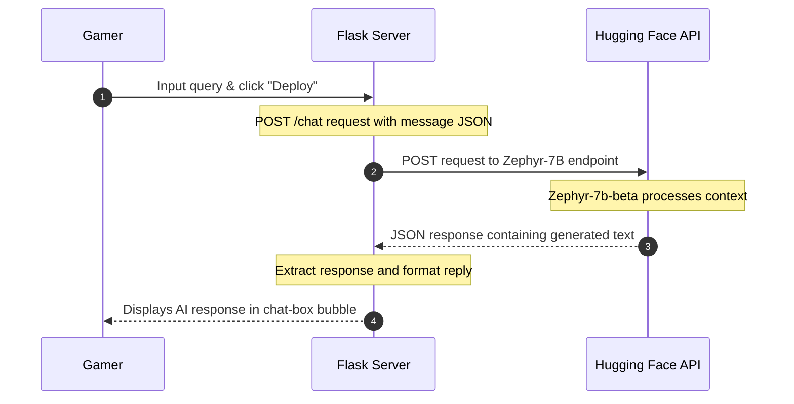

# 🎮 AI Esports Chatbot

<div align="center">

[](https://www.python.org/)
[](https://flask.palletsprojects.com/)
[](https://huggingface.co/)
[](https://html.spec.whatwg.org/)
[](https://www.w3.org/TR/css3-roadmap/)

---

### 🚀 Real-Time Gaming Tactics & Strategy Advisor
*An AI-powered coaching companion designed to deliver character advice, map strategies, item configurations, and counter-tactics in real time.*

[🛠️ System Architecture](#-architecture) • [💡 Features](#-features) • [⚡ Installation & Setup](#-getting-started)

</div>

---

## 💡 Features

*   **Esports-Focused NLP:** Powered by the **Zephyr-7B-beta** model to respond intelligently to tactical gaming questions (e.g., weapon selections, positioning, game rules, and competitive coaching).
*   **Neon Gaming UI:** Fully immersive dark cyber aesthetics using custom CSS box shadows, glow text, and styled scroll elements.
*   **Gamer Welcome & Typing States:** Custom greeting cards and real-time "⚡ Typing..." indicator bubbles to simulate a live opponent or coach.
*   **Atmospheric Video Background:** Fully integrated loops to keep the UI engaging and reactive.

---

## 🛠️ Architecture

The chatbot operates as a client-server web app requesting completions from Hugging Face's high-speed inference endpoints:



---

## 📂 Project Structure

*   [server.py](file:///C:/Users/vigne/Desktop/Github/AI-Esports-Project/server.py): Flask backend containing the router and the client API requester.
*   [index.html](file:///C:/Users/vigne/Desktop/Github/AI-Esports-Project/index.html): Gamer-themed chat interface using custom styling templates.
*   [styles.css](file:///C:/Users/vigne/Desktop/Github/AI-Esports-Project/styles.css): Complete styling sheets defining CSS variables, neon container borders, gradient bubbles, and font bindings.
*   [script.js](file:///C:/Users/vigne/Desktop/Github/AI-Esports-Project/script.js): A Canvas particle stars generator script (available for background upgrades).

---

## ⚡ Getting Started

### 📋 Prerequisites
Make sure Python is installed on your local computer. Then, install the required Flask dependencies:
```bash
pip install flask requests python-dotenv
```

### 🔑 Hugging Face API Setup (Security Best Practice)
To prevent your API keys from leaking publicly on GitHub, avoid hardcoding keys inside `server.py`. Instead, follow these steps:

1. Create a file named `.env` in the root folder of this project:
   ```env
   HF_API_KEY=your_hugging_face_api_token_here
   ```
2. Modify [server.py](file:///C:/Users/vigne/Desktop/Github/AI-Esports-Project/server.py) to read the key dynamically using the environment loader:
   ```python
   import os
   from dotenv import load_dotenv
   
   load_dotenv()
   API_KEY = os.getenv("HF_API_KEY")
   ```

### 🚀 Running the App
1. Start the Flask server:
   ```bash
   python server.py
   ```
2. Open your web browser and navigate to:
   ```http
   http://127.0.0.1:5000/
   ```
3. Type in your tactical question and click **Deploy 🚀**!

---

<div align="center">
  <sub>Developed by <a href="https://github.com/karnavignesh">Karna Vignesh</a>. Connect with me on <a href="http://www.linkedin.com/in/karnavignesh">LinkedIn</a>.</sub>
</div>
